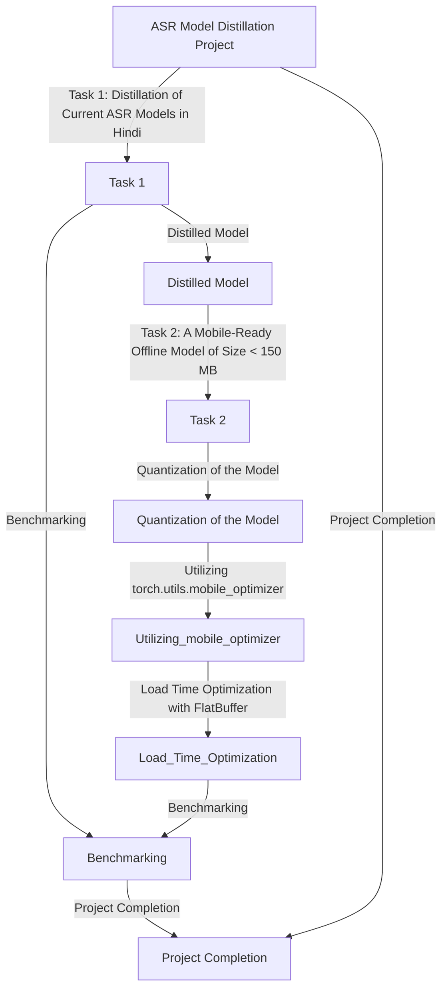

# Linear-Regression--Diabetes

```mermaid
graph TD
    ASR_Model_Distillation_Project[ASR Model Distillation Project] -->|Task 1: Distillation of Current ASR Models in Hindi| Task_1[Task 1]
    Task_1 -->|Distilled Model| Distilled_Model[Distilled Model]
    Task_1 -->|Benchmarking| Benchmarking

    Distilled_Model -->|Task 2: A Mobile-Ready Offline Model of Size < 150 MB| Task_2[Task 2]
    Task_2 -->|Quantization of the Model| Quantization[Quantization of the Model]
    Quantization -->|Utilizing torch.utils.mobile_optimizer| Utilizing_mobile_optimizer
    
    Utilizing_mobile_optimizer -->|Load Time Optimization with FlatBuffer| Load_Time_Optimization
    Load_Time_Optimization -->|Benchmarking| Benchmarking

    Benchmarking -->|Project Completion| Project_Completion[Project Completion]

    ASR_Model_Distillation_Project -->|Project Completion| Project_Completion

```
